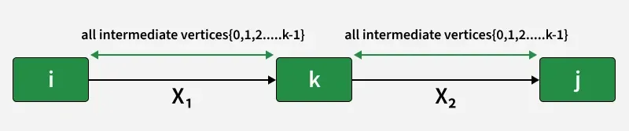

# Graph Theory Project 2025-2026

The Floyd–Warshall algorithm makes it possible to compute minimum‑value paths from any vertex
to any other vertex in a directed weighted graph. This algorithm is based on Warshall’s algorithm,
which is dedicated to computing the transitive closure of a graph. The computation of this transitive
closure is adapted in order to retain, among all paths connecting two vertices, those with the smallest
value.

  

<em>Figure 1.1, Substructure of the Floyd Warshall Algorithm</em>

Why does Floyd Warshall work?
The algorithm relies on the principle of optimal substructure, meaning:

If the shortest path from i to j passes through some vertex k, then the path from i to k and the path from k to j must also be shortest paths.
The iterative approach ensures that by the time vertex k is considered, all shortest paths using only vertices 0 to k-1 have already been computed.
By the end of the algorithm, all shortest paths are computed optimally because each possible intermediate vertex has been considered[^1].

We can find the following pseudo code[^2]:\
`let dist be a |V| × |V| array of minimum distances initialized to ∞ (infinity)`\
`for each edge (u, v) do`\
`     dist[u][v] = w(u, v)  // The weight of the edge (u, v)`\
`for each vertex v do`\
`     dist[v][v] = 0`\
`for k from 1 to |V|`\
`   for i from 1 to |V|`\
`       for j from 1 to |V|`\
`           if dist[i][j] > dist[i][k] + dist[k][j]` \
`               dist[i][j] = dist[i][k] + dist[k][j]`\
`           end if`

## Goal of this project:

This project goal is to implement the FloydWarshall algorithm for multiples graphs given by the teachers.
The following graphs can be found in the `graphs` file.

We have to respect the following **constraints**:

• Directed graph \
• Weighted graph — integer numerical values (negative values allowed, ‘0’ allowed).\
• Vertices represented by integers from ‘0’ to ‘number of vertices minus 1’.\
• At most one arc from a vertex x to a vertex y.

The program must not impose any limit on the number of vertices, arc values, or number of arcs.

If, there is no absorbing circuit. \
The user can print a path from a `start` vertex to and `end` vertex. \
(Those vertices should be between 0 and the number of vertices - 1)

If `start` = `end` the shortest path will always be the vertex and thats it.

If an **absorbing circuit / negative cycle** is detected.\
We stop the program and indicate the vertex for which we have an absorbing circuit.

## Real case scenario

Building links between atoms in complex molecules to represent them in 3D

We can find the following files and directories:
- `.h` files: to define structures and functions
- `.c` files: to write our code
- `graphs` directory containing `.txt` files which are all the graps needed for evaluation, in a suitable form for our program

### References:

[^1]: Geeks4Geeks https://www.geeksforgeeks.org/dsa/floyd-warshall-algorithm-dp-16/
[^2]: Wikipédia https://en.wikipedia.org/wiki/Floyd%E2%80%93Warshall_algorithm
